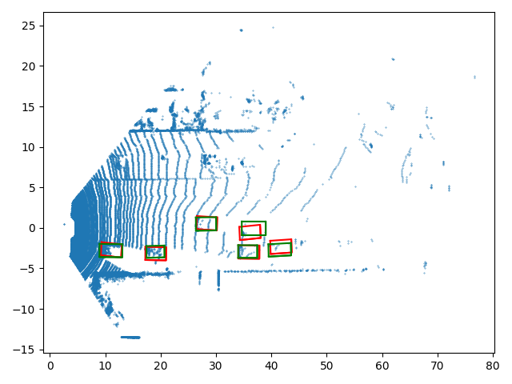
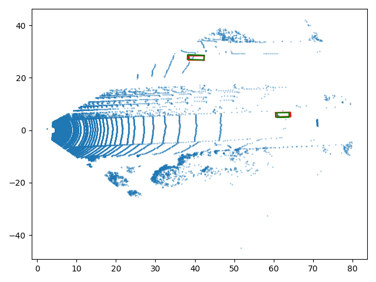

# pixor-tf
Implementation of [PIXOR: Real-time 3D Object Detection from Point Clouds](https://arxiv.org/pdf/1902.06326.pdf) in tensorflow. This work I used as a part of my Master Thesis. The code is working but really messy right now. Will make the code clean in coming days. 

## Inference Plots

